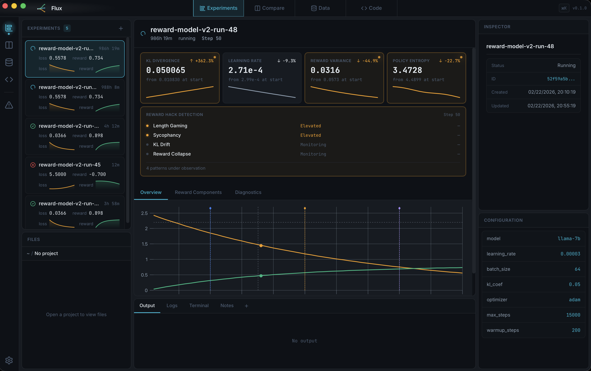

# Flux

**The ML development environment.**
*Write code. Watch it learn.*



<p align="center">
  
  
  
</p>

<p align="center">
  
  
  
  
  
</p>

---

## Overview

Flux is a lightweight, workspace-focused IDE designed specifically for machine learning development. Built with [Wails](https://wails.io) (Go + React), it delivers native desktop performance in a ~15MB binary.

### Features

- **Project Workspaces**: Create, import, reopen, and switch Flux projects with `flux.yaml` configuration and recent-project state
- **Experiment Tracking**: Create, manage, and monitor ML experiments with real-time status updates
- **Inline Metrics**: Live loss and reward values displayed on each experiment card
- **Sparkline Charts**: Mini SVG trend charts with LTTB downsampling for at-a-glance metric visualization
- **Diagnostic Metric Cards**: KL divergence, learning rate, reward variance, and policy entropy with health-colored borders, trend indicators, and inline sparklines
- **Reward Hack Indicators**: Go-backed heuristic pattern analysis for length gaming when response length is logged, sycophancy, KL drift, and reward collapse, with persisted alert records
- **Chart Foundation**: uPlot-based time-series, reward-component, annotation, and histogram chart components
- **Resizable Panel Layout**: Persistent, draggable panel arrangement with collapsible columns
- **Event-Driven Updates**: Real-time metric streaming via Wails event system -- no polling
- **Performance-First**: Cold start < 2-4s, near-zero idle CPU, ~200-450MB RAM

### Planned

- **Chart Interactions**: Zoom/pan, click-to-inspect, anomaly zones, distribution views, and baseline overlays
- **Chart Scalability**: Backend downsampling/windowing for large metric histories
- **Run Profiles**: First-class support for ML training scripts and deployment commands
- **Alert UI**: Evidence display, alert badges, acknowledgement/ignore actions, and inline training-output alerts
- **File System Views**: Project file tree, config editing, and click-to-source navigation

## Tech Stack

- **Framework**: [Wails v2](https://wails.io) - Go backend + React frontend
- **Frontend**: React 19 + TypeScript + Vite
- **Backend**: Go 1.23+
- **Platforms**: macOS, Windows, Linux

## Development

### Prerequisites

- Go 1.23+
- Node.js 18+
- Wails CLI (`go install github.com/wailsapp/wails/v2/cmd/wails@latest`)

### Getting Started

```bash
# Clone the repository
git clone https://github.com/kstruzzieri/flux-ml.git
cd flux-ml

# Install frontend dependencies
cd frontend && npm install && cd ..

# Run in development mode
wails dev

# Build for production
wails build
```

### Verification

```bash
# Backend
go test ./...

# Frontend
cd frontend
npm test -- --runInBand
npm run typecheck
npm run lint
```

## Project Status

This project is in active development. See the [GitHub Issues](https://github.com/kstruzzieri/flux-ml/issues) for the roadmap.

### Completed

- **Phase 1: Foundation** -- Wails setup, core UI shell with resizable panels, icon system, design tokens
- **Phase 2A: Data Layer** -- SQLite integration, experiment CRUD, event sourcing, metrics storage
- **Phase 2B: Experiment List** -- Wails bindings, experiment list UI, inline metrics display, sparkline charts
- **Phase 2C: Experiment Detail** -- Diagnostic metric cards with health indicators, Go-backed reward hack indicators, uPlot chart integration with live updates
- **Phase 2D: Project Model & UI** -- `flux.yaml`, project-scoped experiments, new/import/open flows, recent projects, and degraded mode

### In Progress

- **Phase 3: Charts & Visualization** -- uPlot integration, reusable chart components, live updates, annotations, reward components, divergence/anomaly zones, and histogram component are complete. Remaining work is focused on chart scalability, zoom/pan, click-to-inspect, distribution views, and baseline overlays.

### Phases

1. **Foundation** - Wails setup, core infrastructure
2. **Experiments Core & Projects** - SQLite, experiment management, metrics storage, experiment UI, project model
3. **Charts & Visualization** - Interactive charts, reward-component analysis, distributions, overlays
4. **Alert System** - Detector hardening, evidence UI, alert actions, badges, and inline alert surfaces
5. **Integration** - Training logs/processes, file system views, comparison workflows
6. **Polish** - Performance optimization, keyboard UX, exports, documentation

## Architecture

```
flux-ml/
├── main.go              # Wails application entry point
├── app.go               # App lifecycle, stores, layout persistence
├── *_api.go             # Wails API surface grouped by domain
├── internal/            # Go backend packages
│   ├── annotation/      # Chart annotations and events
│   ├── database/        # SQLite infrastructure, migrations
│   ├── experiment/      # Experiment CRUD store
│   ├── event/           # Event sourcing store
│   ├── metrics/         # Metrics and reward signal storage
│   └── project/         # Project model, config, scaffold, local state
├── frontend/            # React + TypeScript frontend
│   ├── src/
│   │   ├── components/  # React components
│   │   ├── components/Charts/
│   │   ├── components/Experiments/
│   │   ├── components/project/
│   │   ├── stores/      # Zustand state management
│   │   ├── utils/       # Shared utilities (formatting, downsampling)
│   │   ├── hooks/       # Custom React hooks
│   │   └── styles/      # CSS design tokens and components
│   └── wailsjs/         # Generated Wails bindings
├── docs/                # Design docs and TDD documentation
└── assets/              # Branding and static assets
```

### Architecture Decisions

Key technical choices and their rationale:

| Decision | Choice | Rationale |
|----------|--------|-----------|
| CSS | Vanilla CSS + BEM | Zero runtime overhead, optimal for fixed desktop UI |
| State | Zustand | Lightweight, minimal boilerplate, scales well with domain stores |
| Charts | uPlot | Lightweight Canvas-based, handles 100k+ points |
| Database | SQLite (`modernc.org/sqlite`) | Embedded, pure Go, no CGo, works offline |

See [`docs/plan/08-frontend-architecture.md`](docs/plan/08-frontend-architecture.md) for detailed documentation.

## License

MIT
