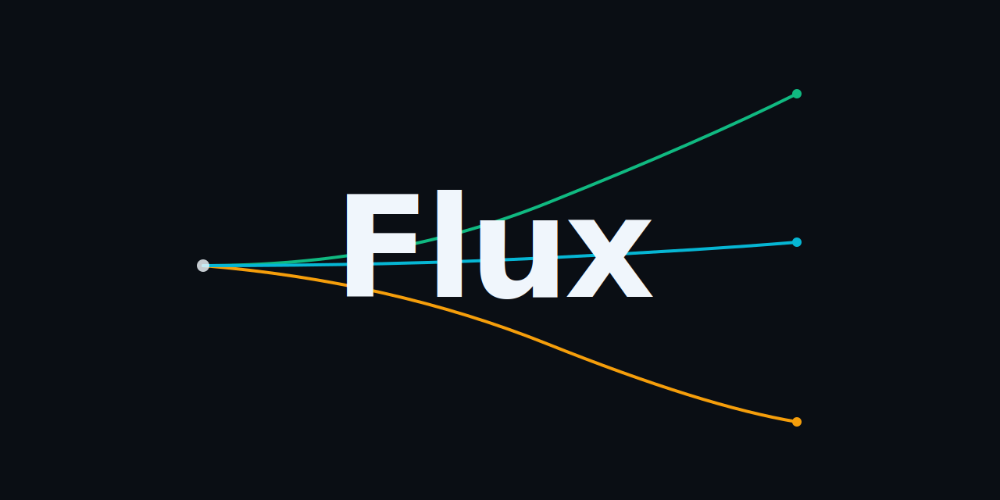
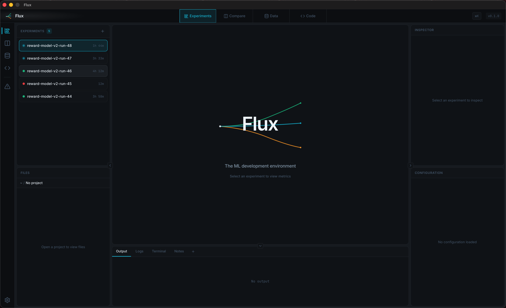

# Flux



**The ML development environment.**
*Write code. Watch it learn.*



---

## Overview

Flux is a lightweight, workspace-focused IDE designed specifically for machine learning development. Built with [Wails](https://wails.io) (Go + React), it delivers native desktop performance in a ~15MB binary.

### Key Features (Planned)

- **Workspace Model**: Multiple focused workspaces per repository with independent layouts and run configurations
- **Run Profiles**: First-class support for ML training scripts, experiments, and deployment commands
- **Integrated Visualizations**: Real-time training metrics, loss curves, and model performance charts
- **Reward Signal Monitoring**: Track helpfulness, harmlessness, and honesty metrics for RLHF workflows
- **Language Server Support**: TypeScript, Python, and Go via LSP
- **Performance-First**: Cold start < 2-4s, near-zero idle CPU, ~200-450MB RAM

## Tech Stack

- **Framework**: [Wails v2](https://wails.io) - Go backend + React frontend
- **Frontend**: React 18 + TypeScript + Vite
- **Backend**: Go 1.23+
- **Platforms**: macOS, Windows, Linux

## Development

### Prerequisites

- Go 1.23+
- Node.js 18+
- Wails CLI (`go install github.com/wailsapp/wails/v2/cmd/wails@latest`)

### Getting Started

```bash
# Clone the repository
git clone https://github.com/kstruzzieri/flux-ml.git
cd flux-ml

# Install frontend dependencies
cd frontend && npm install && cd ..

# Run in development mode
wails dev

# Build for production
wails build
```

## Project Status

This project is in active development. See the [GitHub Issues](https://github.com/kstruzzieri/flux-ml/issues) for the roadmap.

### Completed

- **Phase 1: Foundation** — Wails setup, core UI shell with resizable panels, icon system, design tokens
- **Phase 2A: Data Layer** — SQLite integration, experiment CRUD, event sourcing, metrics storage (59 tests across 4 packages)

### Phases

1. **Foundation** - Wails setup, core infrastructure
2. **Data Layer** - SQLite, experiment management, event sourcing, metrics storage
3. **File System** - File explorer, editor, workspace management
4. **Editor Core** - CodeMirror integration, syntax highlighting
5. **Run System** - Run profiles, terminal integration
6. **ML Features** - Visualizations, metrics, experiment tracking
7. **Polish** - Performance optimization, packaging

## Architecture

```
flux-ml/
├── main.go              # Application entry point
├── app.go               # Wails application logic / Go backend
├── internal/            # Go backend packages
│   ├── database/        # SQLite infrastructure, migrations
│   ├── experiment/      # Experiment CRUD store
│   ├── event/           # Event sourcing store
│   └── metrics/         # Metrics and reward signal storage
├── frontend/            # React + TypeScript frontend
│   ├── src/
│   │   ├── components/  # React components
│   │   ├── styles/      # CSS design tokens and components
│   │   └── hooks/       # Custom React hooks
│   └── wailsjs/         # Generated Wails bindings
├── docs/                # Design docs and TDD documentation
└── assets/              # Branding and static assets
```

### Architecture Decisions

Key technical choices and their rationale:

| Decision | Choice | Rationale |
|----------|--------|-----------|
| CSS | Vanilla CSS + BEM | Zero runtime overhead, optimal for fixed desktop UI |
| State | React built-in | Sufficient for Phase 1; evaluate libraries as complexity grows |
| Charts | uPlot (planned) | Lightweight Canvas-based, handles 100k+ points |
| Database | SQLite (`modernc.org/sqlite`) | Embedded, pure Go, no CGo, works offline |

See [`docs/plan/08-frontend-architecture.md`](docs/plan/08-frontend-architecture.md) for detailed documentation.

## License

MIT
